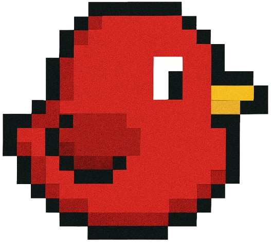

# Flappy Bird – Pygame Edition

Egy modern, reszponzív Flappy Bird-szerű játék Pythonban, Pygame-mel. Saját sprite-ok, rekord- és coin-kezelés, dinamikus ablakméret, platformfüggetlen futás, menü, és szép vizuális effektek.

## Főbb jellemzők
- **Reszponzív**: minden ablakmérethez igazodik
- **Sprite scaling**: madár, cső, háttér saját képekkel
- **Pontszám, rekord, coin**: rekord és coin örökre mentve
- **Random csőgenerálás**: mindig játszható pálya
- **Menü, újraindítás, kilépés**
- **Modern, letisztult grafika**

## Telepítés
1. Python 3.8+ szükséges
2. Függőségek telepítése:
   ```bash
   pip install -r requirements.txt
   ```
3. Indítás:
   ```bash
   python game.py
   ```

## Irányítás
- **SPACE** – ugrás / újraindítás
- **ESC** – kilépés

## Fájlok
- `game.py` – fő játéklogika
- `assets/images/` – sprite-ok, háttér
- `best_score.txt` – rekord és coin mentése
- `requirements.txt` – függőségek (pygame)

## Képernyőképek



## Készítette
Buzás Barnabás – 2025

---

Kellemes játékot!
